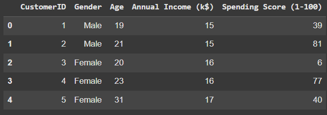
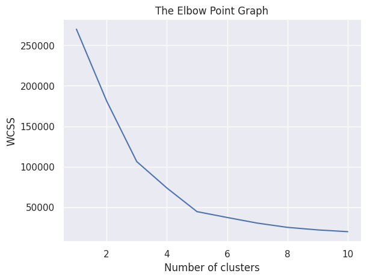
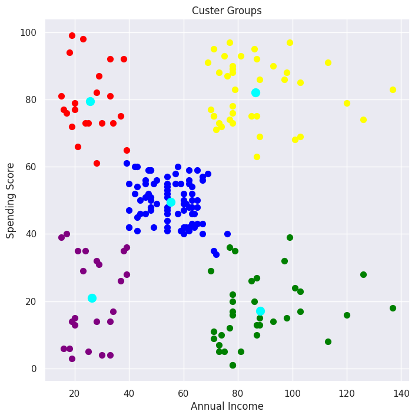

***Customer Segmentation using K-Means***

This project applies K-Means clustering to perform customer segmentation based on:
  -Annual Income
  -Spending Score
  -Gender

**Objective**
The goal is to group customers into distinct clusters to help businesses identify patterns in customer behavior and design targeted marketing strategies.

**Steps**
1. Load the dataset (Mall Customers dataset).
   
3. Preprocess features (Annual Income, Spending Score, Gender encoding).
4. Apply K-Means Clustering to form customer groups.
   
6. Visualize clusters in 2D/3D plots.
   

**Results**

Customers are segmented into groups such as high income–high spenders, low income–low spenders, etc.

Visualizations show clear separation between clusters.

**Tech Stack**
  -Python
  -scikit-learn
  -pandas
  -matplotlib / seaborn

